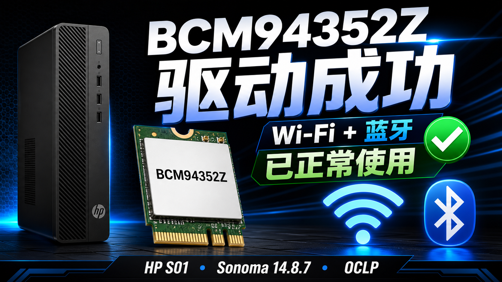
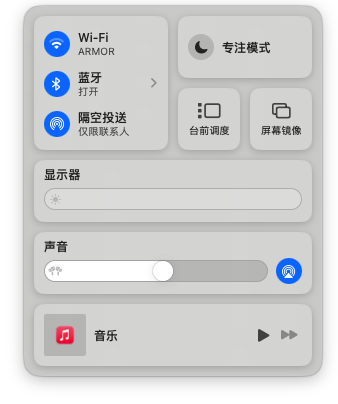
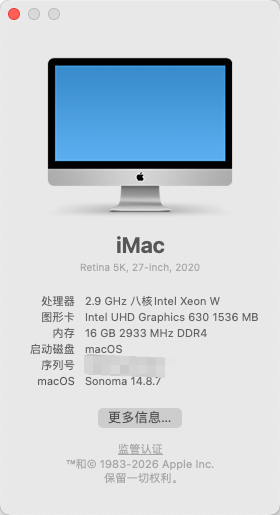

# HP S01 i7-10700 B460 Sonoma EFI



OpenCore EFI variants for the HP Slim Desktop S01 platform.

Tested machine:

- Model: HP Slim Desktop S01 / S01-pF1xxx
- Motherboard: HP B460 platform
- CPU: Intel Core i7-10700
- iGPU: Intel UHD Graphics 630
- Audio: Realtek ALC897, `alcid=11`
- Ethernet: Realtek RTL8111
- macOS: Sonoma 14.8.x
- SMBIOS: iMac20,1

## Versions

This repository keeps two EFI variants side by side.

| Path | Purpose |
| --- | --- |
| `EFI-HP-Stock/EFI` | Baseline EFI for the original HP S01 hardware profile. The factory Realtek RTL8821CE Wi-Fi is not supported by macOS and remains disabled. |
| `EFI-BCM94352Z/EFI` | Tested EFI for BCM94352Z / DW1560 on macOS Sonoma 14.8.7 with OCLP Modern Wireless root patch. Wi-Fi, Bluetooth, USB, and the mechanical HDD were verified working. |

To use a variant, copy the inner `EFI` directory to the target EFI partition.

## Current Verified BCM94352Z Result

The `EFI-BCM94352Z` variant was tested after updating to:

```text
macOS Sonoma 14.8.7
Build 23J520
OpenCore Legacy Patcher 2.4.1
```

Verified working:

- Wi-Fi scans hotspots and connects normally
- Bluetooth scans and connects normally
- Bluetooth headset audio is smooth
- USB flash drives are detected
- Mechanical HDD mounts normally
- Ethernet remains available

Screenshots from the tested machine:





The Broadcom Wi-Fi root patch is not fully contained in EFI. After installing or updating macOS, run OpenCore Legacy Patcher and apply:

```text
Post-Install Root Patch -> Networking: Modern Wireless
```

## Important Before Booting

Do not reuse someone else's SMBIOS identity. Generate your own values and update:

- `PlatformInfo -> Generic -> SystemSerialNumber`
- `PlatformInfo -> Generic -> MLB`
- `PlatformInfo -> Generic -> SystemUUID`
- `PlatformInfo -> Generic -> ROM`

Also review boot picker entries, BIOS settings, storage layout, USB mapping, and network card before using either EFI on a different HP S01 unit.

## BCM94352Z Notes

BCM94352Z / DW1560 on Sonoma needs more than the old `AirportBrcmFixup` recipes. The working path here is:

- `IOSkywalkFamily.kext`
- `IO80211FamilyLegacy.kext`
- `IO80211FamilyLegacy.kext/Contents/PlugIns/AirPortBrcmNIC.kext`
- `AirportBrcmFixup.kext`
- `AirportBrcmFixup.kext/Contents/PlugIns/AirPortBrcmNIC_Injector.kext`
- OCLP `Modern Wireless` root patch

The tested setup does not use:

- `AMFIPass.kext`
- `BrcmBluetoothInjector.kext`
- `AirPortBrcm4360_Injector.kext`
- Wi-Fi DeviceProperties spoofing
- `brcmfx-country=HK`
- `-lilubetaall`

See [docs/BCM94352Z-Sonoma-14.8.7.md](docs/BCM94352Z-Sonoma-14.8.7.md) for the full tested notes and pitfalls.

## Known Limitations

- The factory Realtek RTL8821CE Wi-Fi card is not supported by this EFI under macOS.
- OCLP root patches must be re-applied after macOS updates.
- System sleep is not the primary tested workflow. Display sleep was used during daily testing.
- This EFI is shared as a reference, not a universal installer.
